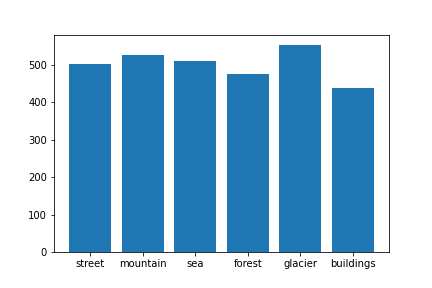

# MultiClass Classification Using GoogleNet

## Introduction

The [ImageNet Large Scale Visual Recognition Challenge (ILSVRC)](https://image-net.org/challenges/LSVRC/) evaluates algorithms for object detection and image classification at large scale. Reseachers at Google introduced a Deep Convolution Neural Network Architecture codenamed "Inception" and named the paper ["Going Deeper with Convolutions"](https://arxiv.org/abs/1409.4842). The main hallmark of this architecture is the improved utilization of the computing resources inside the network. This was achieved by a carefully crafted design that allows for increasing the depth and width of the network while keeping the computational budget constant. To optimize quality, the architectural decisions were based on the Hebbian principle and the intuition of multi-scale processing. One particular incarnation used in our submission for ILSVRC 2014 is called GoogLeNet, a 22 layers deep network, the quality of which is assessed in the context of classification and detection.

Reference: [Paperswithcode](https://paperswithcode.com/paper/going-deeper-with-convolutions)

GoogLeNet incarnation of the Inception architecture

## Data Collection

The Train, Test and Prediction data is separated in each zip files. There are around 14k images in Train, 3k in Test and 7k in Prediction.This data was initially published on https://datahack.analyticsvidhya.com by Intel to host a Image classification Challenge.
Download: [Intel Image Classification](https://www.kaggle.com/datasets/puneet6060/intel-image-classification)

#### Training Image Sample

#### Testing Image Sample

